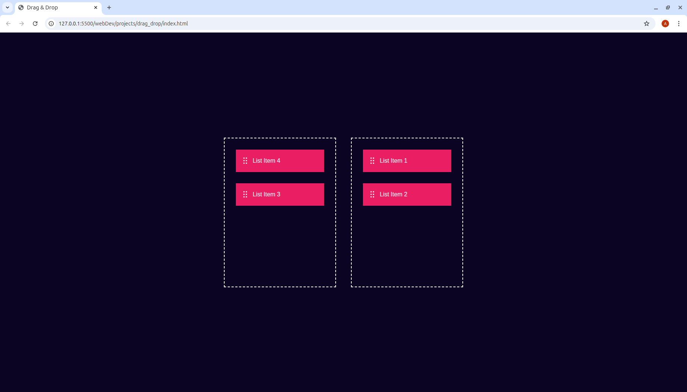

# 🚀 Drag & Drop Web App

This is a simple HTML, CSS, and JavaScript project demonstrating **drag-and-drop functionality**. Users can drag list items (with icons) from one container to another using the mouse.

---

## 📦 Features

- Drag items from **Left Box** to **Right Box** and vice versa.
- Uses native **HTML5 Drag and Drop API**.
- Styled with minimal **CSS**.
- Supports text and image/icon in each item.

---

## 🧰 Tech Stack

- HTML5
- CSS3
- JavaScript (Vanilla)

---

## 🖼️ Screenshot

!

*(Add a screenshot image named `screenshot.png` in your project root for this to work)*

---

## 📂 Folder Structure

---

## ⚙️ How to Run

1. Clone or download this repository.
2. Ensure the file structure matches the above.
3. Open `index.html` in your browser.
4. Drag items between the left and right boxes!

---

## 📌 Notes

- Make sure the image file `icon.png` exists in the same directory.
- Works on all modern browsers that support HTML5 Drag & Drop.

---

## 👤 Author

**Abdulfattah Nizamani**  
[LinkedIn](https://www.linkedin.com/in/your-link)

---

## 📄 License

This project is licensed under the [MIT License](https://choosealicense.com/licenses/mit/)
